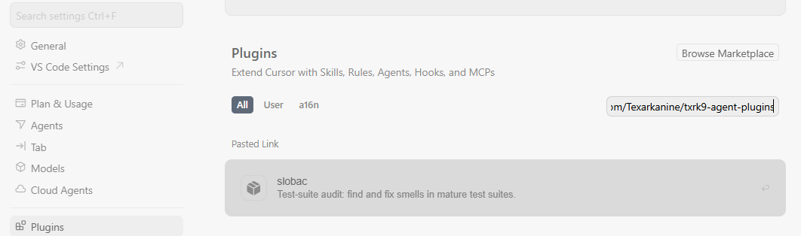
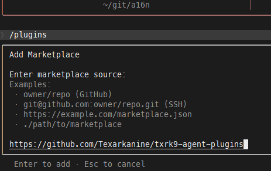

# txrk9-agent-plugins

Plugin Marketplaces to install the agentic coding harness plugins I've built.

## Cursor

1. Open "Cursor Settings"
2. Navigate to "Plugins"
3. Paste this repository's URL - `https://github.com/Texarkanine/txrk9-agent-plugins` - into the "Search or Paste Link" box:

    
4. You are now able to install my plugins :)

## Claude Code

1. Run `/plugins`
2. Navigate to "Marketplaces"
3. Paste this repository's URL - `https://github.com/Texarkanine/txrk9-agent-plugins` - into the box:

    
4. You are now able to install my plugins :)
